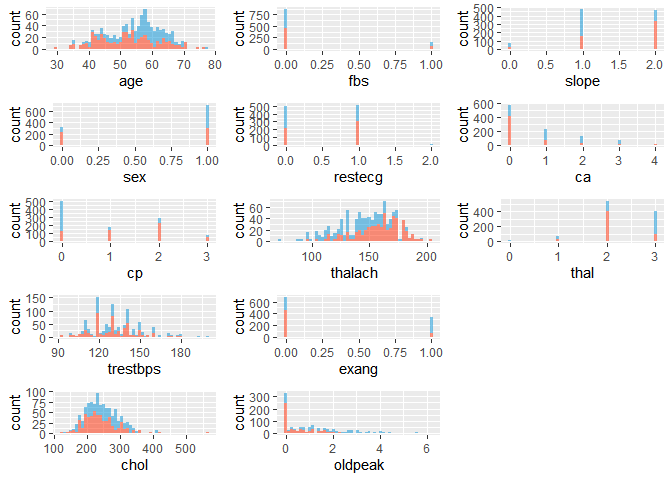
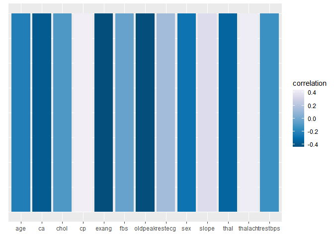

Data Summary
================

- [Data](#data)
- [Histograms](#histograms)
- [Correlations](#correlations)

``` r
pacman::p_load(dplyr,
               ggplot2,
               ggthemes,
               skimr,
               gridExtra,
               Rmisc)

as_latex <- FALSE
```

# Data

``` r
df <- read.csv(file = file.path('data', 'heart.csv'))
X <- select(df, -target)
y <- select(df, target)

if (as_latex == TRUE) {
  stargazer::stargazer(skim(df))
} else {
  skim(df)
}
```

|                                                  |      |
|:-------------------------------------------------|:-----|
| Name                                             | df   |
| Number of rows                                   | 1025 |
| Number of columns                                | 14   |
| \_\_\_\_\_\_\_\_\_\_\_\_\_\_\_\_\_\_\_\_\_\_\_   |      |
| Column type frequency:                           |      |
| numeric                                          | 14   |
| \_\_\_\_\_\_\_\_\_\_\_\_\_\_\_\_\_\_\_\_\_\_\_\_ |      |
| Group variables                                  | None |

Data summary

**Variable type: numeric**

| skim_variable | n_missing | complete_rate |   mean |    sd |  p0 | p25 |   p50 |   p75 |  p100 | hist  |
|:--------------|----------:|--------------:|-------:|------:|----:|----:|------:|------:|------:|:------|
| age           |         0 |             1 |  54.43 |  9.07 |  29 |  48 |  56.0 |  61.0 |  77.0 | ▁▅▇▇▁ |
| sex           |         0 |             1 |   0.70 |  0.46 |   0 |   0 |   1.0 |   1.0 |   1.0 | ▃▁▁▁▇ |
| cp            |         0 |             1 |   0.94 |  1.03 |   0 |   0 |   1.0 |   2.0 |   3.0 | ▇▃▁▅▁ |
| trestbps      |         0 |             1 | 131.61 | 17.52 |  94 | 120 | 130.0 | 140.0 | 200.0 | ▃▇▅▁▁ |
| chol          |         0 |             1 | 246.00 | 51.59 | 126 | 211 | 240.0 | 275.0 | 564.0 | ▃▇▂▁▁ |
| fbs           |         0 |             1 |   0.15 |  0.36 |   0 |   0 |   0.0 |   0.0 |   1.0 | ▇▁▁▁▂ |
| restecg       |         0 |             1 |   0.53 |  0.53 |   0 |   0 |   1.0 |   1.0 |   2.0 | ▇▁▇▁▁ |
| thalach       |         0 |             1 | 149.11 | 23.01 |  71 | 132 | 152.0 | 166.0 | 202.0 | ▁▂▅▇▂ |
| exang         |         0 |             1 |   0.34 |  0.47 |   0 |   0 |   0.0 |   1.0 |   1.0 | ▇▁▁▁▅ |
| oldpeak       |         0 |             1 |   1.07 |  1.18 |   0 |   0 |   0.8 |   1.8 |   6.2 | ▇▂▁▁▁ |
| slope         |         0 |             1 |   1.39 |  0.62 |   0 |   1 |   1.0 |   2.0 |   2.0 | ▁▁▇▁▇ |
| ca            |         0 |             1 |   0.75 |  1.03 |   0 |   0 |   0.0 |   1.0 |   4.0 | ▇▃▂▁▁ |
| thal          |         0 |             1 |   2.32 |  0.62 |   0 |   2 |   2.0 |   3.0 |   3.0 | ▁▁▁▇▆ |
| target        |         0 |             1 |   0.51 |  0.50 |   0 |   0 |   1.0 |   1.0 |   1.0 | ▇▁▁▁▇ |

# Histograms

``` r
col_names <- names(X)
n_cols <- length(col_names)
plots <- list()

for (i in 1:n_cols) {
  col_ <- col_names[i]
  column <- sym(col_)

  plots[[col_]] <- ggplot(df, aes(x = !!column, fill = as.factor(target))) +
          geom_histogram(alpha = 0.5, bins = 50) +
          scale_fill_fivethirtyeight() +
          theme(legend.position = 'none')
}

# png('plots/histograms.png', height = 8.5, width = 11, units = 'in', res = 250)
multiplot(plotlist = plots, cols = 5)
```

<!-- -->

``` r
# dev.off()
```

# Correlations

``` r
corr_mat <- data.frame(cor(df))
row_names <- row.names(corr_mat)
corr_mat <- select(corr_mat, 'target')
corr_mat$y <- rep(1, nrow(corr_mat))
corr_mat$var <- row_names
corr_mat <- corr_mat[!(row_names == 'target'),]

ggplot(corr_mat, aes(x = var, y = y, fill=target)) +
        geom_col() +
        scale_fill_distiller(palette = 'PuBu', name = 'correlation') +
        theme(axis.ticks.y = element_blank(),
              axis.text.y = element_blank()) +
        ylab(element_blank()) +
        xlab(element_blank())
```

<!-- -->

``` r
# ggsave('plots/correlation.png')
```
