Data Summary
================

- [Preprocess Data](#preprocess-data)
- [Logistic Regression](#logistic-regression)
- [Random Forests](#random-forests)
- [BART](#bart)

``` r
pacman::p_load(dplyr,
               fastDummies,
               caret,
               bartMachine,
               stargazer
)

source('ROC.R')
source('RFTree.R')

set.seed(10)
```

# Preprocess Data

``` r
df <- read.csv(file = file.path('data', 'heart.csv'))

# create dummy variables
df$thal <- as.factor(df$thal)
df$cp <- as.factor(df$cp)
df$restecg <- as.factor(df$restecg)
df$slope <- as.factor(df$slope)
df$ca <- as.factor(df$ca)
df <- dummy_cols(df) %>%
  select('age', 'sex', 'trestbps', 'chol', 'fbs', 'thalach', 'exang', 'oldpeak', 'cp_1', 'cp_2', 'cp_3', 'restecg_1',
         'restecg_2', 'slope_1', 'slope_2', 'ca_1', 'ca_2', 'ca_3', 'ca_4', 'thal_1', 'thal_2', 'thal_3', 'target')

# rename columns
colnames(df) <- c('age', 'sex', 'resting blood pressure', 'serum cholesterol', 'fasting blood sugar > 120 mg/dl',
                 'maximum heart rate achieved', 'exercise induced angina', 'oldpeak', 'chest pain = 1',
                 'chest pain = 2', 'chest pain = 3', 'resting electrocardiograph = 1', 'resting electrocardiograph = 2',
                 'slope = 1', 'slope = 2', 'major vessels colored = 1', 'major vessels colored = 2',
                 'major vessels colored = 3', 'major vessels colored = 4', 'thalassemia = 1', 'thalassemia = 2',
                 'thalassemia = 3', 'target')

# train/test split
smp_size <- floor(0.6 * nrow(df))
train_ind <- sample(seq_len(nrow(df)), size = smp_size)

df_train <- df[train_ind, ]
df_test <- df[-train_ind, ]
X_test <- select(df_test, -target)
y_test <- df_test$target

ctrl <- trainControl(method = 'cv', number = 5)
```

# Logistic Regression

``` r
lr_mod <- train(factor(target) ~ ., data = df_train, method = 'glm', family = binomial(link = "logit"), trControl = ctrl)
summary(lr_mod)
```

    ## 
    ## Call:
    ## NULL
    ## 
    ## Deviance Residuals: 
    ##     Min       1Q   Median       3Q      Max  
    ## -2.7682  -0.2963   0.0547   0.4504   3.3091  
    ## 
    ## Coefficients:
    ##                                          Estimate Std. Error z value Pr(>|z|)
    ## (Intercept)                             -0.641409   2.510612  -0.255  0.79835
    ## age                                      0.022203   0.018604   1.193  0.23269
    ## sex                                     -1.748565   0.397958  -4.394 1.11e-05
    ## `\\`resting blood pressure\\``          -0.019840   0.008550  -2.321  0.02031
    ## `\\`serum cholesterol\\``               -0.005260   0.002888  -1.821  0.06860
    ## `\\`fasting blood sugar > 120 mg/dl\\``  0.296628   0.409241   0.725  0.46856
    ## `\\`maximum heart rate achieved\\``      0.022726   0.009033   2.516  0.01187
    ## `\\`exercise induced angina\\``         -0.795494   0.329639  -2.413  0.01581
    ## oldpeak                                 -0.348019   0.180994  -1.923  0.05450
    ## `\\`chest pain = 1\\``                   0.961956   0.395997   2.429  0.01513
    ## `\\`chest pain = 2\\``                   2.028971   0.365380   5.553 2.81e-08
    ## `\\`chest pain = 3\\``                   2.558827   0.579411   4.416 1.00e-05
    ## `\\`resting electrocardiograph = 1\\``   0.150976   0.281241   0.537  0.59139
    ## `\\`resting electrocardiograph = 2\\``  -1.160973   2.173118  -0.534  0.59317
    ## `\\`slope = 1\\``                       -0.619582   0.567822  -1.091  0.27520
    ## `\\`slope = 2\\``                        0.673433   0.601172   1.120  0.26263
    ## `\\`major vessels colored = 1\\``       -2.443326   0.359945  -6.788 1.14e-11
    ## `\\`major vessels colored = 2\\``       -3.271501   0.566718  -5.773 7.80e-09
    ## `\\`major vessels colored = 3\\``       -2.245028   0.810761  -2.769  0.00562
    ## `\\`major vessels colored = 4\\``        1.022481   1.355826   0.754  0.45077
    ## `\\`thalassemia = 1\\``                  2.244612   1.744049   1.287  0.19809
    ## `\\`thalassemia = 2\\``                  2.269069   1.682617   1.349  0.17749
    ## `\\`thalassemia = 3\\``                  0.811895   1.682796   0.482  0.62947
    ##                                            
    ## (Intercept)                                
    ## age                                        
    ## sex                                     ***
    ## `\\`resting blood pressure\\``          *  
    ## `\\`serum cholesterol\\``               .  
    ## `\\`fasting blood sugar > 120 mg/dl\\``    
    ## `\\`maximum heart rate achieved\\``     *  
    ## `\\`exercise induced angina\\``         *  
    ## oldpeak                                 .  
    ## `\\`chest pain = 1\\``                  *  
    ## `\\`chest pain = 2\\``                  ***
    ## `\\`chest pain = 3\\``                  ***
    ## `\\`resting electrocardiograph = 1\\``     
    ## `\\`resting electrocardiograph = 2\\``     
    ## `\\`slope = 1\\``                          
    ## `\\`slope = 2\\``                          
    ## `\\`major vessels colored = 1\\``       ***
    ## `\\`major vessels colored = 2\\``       ***
    ## `\\`major vessels colored = 3\\``       ** 
    ## `\\`major vessels colored = 4\\``          
    ## `\\`thalassemia = 1\\``                    
    ## `\\`thalassemia = 2\\``                    
    ## `\\`thalassemia = 3\\``                    
    ## ---
    ## Signif. codes:  0 '***' 0.001 '**' 0.01 '*' 0.05 '.' 0.1 ' ' 1
    ## 
    ## (Dispersion parameter for binomial family taken to be 1)
    ## 
    ##     Null deviance: 852.56  on 614  degrees of freedom
    ## Residual deviance: 364.86  on 592  degrees of freedom
    ## AIC: 410.86
    ## 
    ## Number of Fisher Scoring iterations: 6

``` r
p_pred <- predict(lr_mod, X_test, type = 'prob')
roc <- ROCMetrics$new(y_true = y_test, p_pred = p_pred$`1`)
thresholds <- roc$threshold.matrix(0.001)
roc$roc_plot(thresholds, file_name = 'plots/lr_roc.png')
```

<!-- -->

``` r
p_th <- row.names(thresholds)[which(thresholds$`Balanced Accuracy` == max(thresholds$`Balanced Accuracy`))]
paste0('Optimal threshold: ', max(p_th))
```

    ## [1] "Optimal threshold: 0.621"

# Random Forests

``` r
rf_mod <- train(factor(target) ~ ., data = df_train, method = 'rf', trControl = ctrl)
rf_mod$finalModel
```

    ## 
    ## Call:
    ##  randomForest(x = x, y = y, mtry = param$mtry) 
    ##                Type of random forest: classification
    ##                      Number of trees: 500
    ## No. of variables tried at each split: 12
    ## 
    ##         OOB estimate of  error rate: 2.76%
    ## Confusion matrix:
    ##     0   1 class.error
    ## 0 297   9  0.02941176
    ## 1   8 301  0.02588997

``` r
tree_func(rf_mod$finalModel, 1, file_name = 'plots/rf_tree.png')
```

<!-- -->

``` r
p_pred <- predict(rf_mod, X_test, type = 'prob')
roc <- ROCMetrics$new(y_true = y_test, p_pred = p_pred$`1`)
thresholds <- roc$threshold.matrix(0.001)
roc$roc_plot(thresholds, file_name = 'plots/rf_roc.png')
```

<!-- -->

``` r
p_th <- row.names(thresholds)[which(thresholds$`Balanced Accuracy` == max(thresholds$`Balanced Accuracy`))]
paste0('Optimal threshold: ', max(p_th))
```

    ## [1] "Optimal threshold: 0.44"

# BART

``` r
set_bart_machine_num_cores(4)
```

    ## bartMachine now using 4 cores.

``` r
X_train <- select(df_train, -target)
y_train <- df_train$target

bart_mod <- bartMachine(X = X_train, y = factor(y_train))
```

    ## bartMachine initializing with 50 trees...
    ## bartMachine vars checked...
    ## bartMachine java init...
    ## bartMachine factors created...
    ## bartMachine before preprocess...
    ## bartMachine after preprocess... 22 total features...
    ## bartMachine training data finalized...
    ## Now building bartMachine for classification where "0" is considered the target level...
    ## evaluating in sample data...done

``` r
bart_mod
```

    ## bartMachine v1.3.3.1 for classification
    ## 
    ## training data size: n = 615 and p = 22 
    ## built in 1.5 secs on 4 cores, 50 trees, 250 burn-in and 1000 post. samples
    ## 
    ## confusion matrix:
    ## 
    ##            predicted 0 predicted 1 model errors
    ## actual 0       271.000      35.000        0.114
    ## actual 1        16.000     293.000        0.052
    ## use errors       0.056       0.107        0.083

``` r
# partial dependency plots
for (i in 1:ncol(X_train)) {
  pd_plot(bart_mod, i)
}
```

    ## ...........

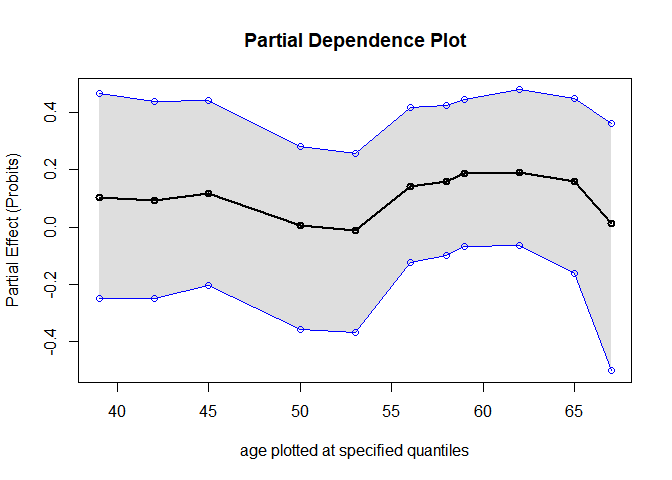<!-- -->

    ## ..

<!-- -->

    ## ...........

<!-- -->

    ## ...........

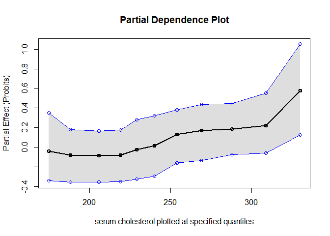<!-- -->

    ## ..

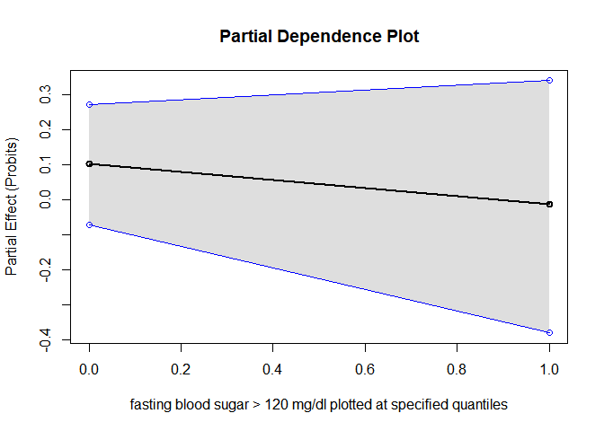<!-- -->

    ## ...........

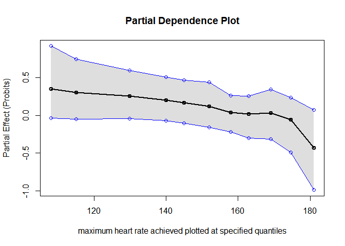<!-- -->

    ## ..

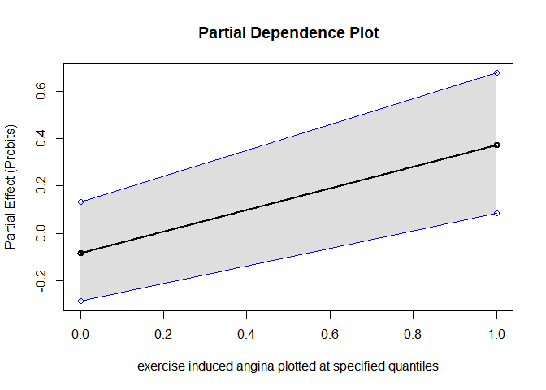<!-- -->

    ## ........

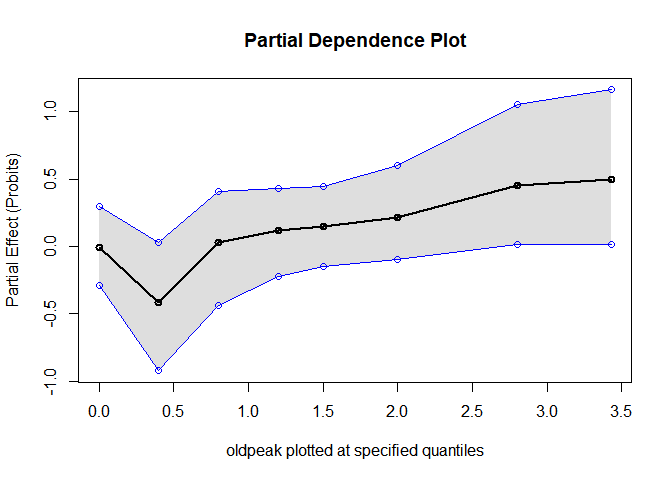<!-- -->

    ## ..

<!-- -->

    ## ..

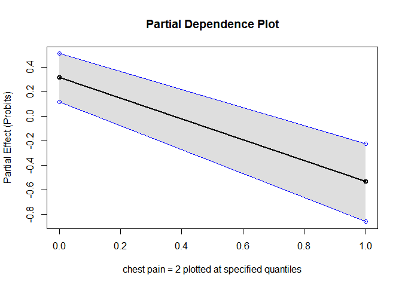<!-- -->

    ## ..

<!-- -->

    ## ..

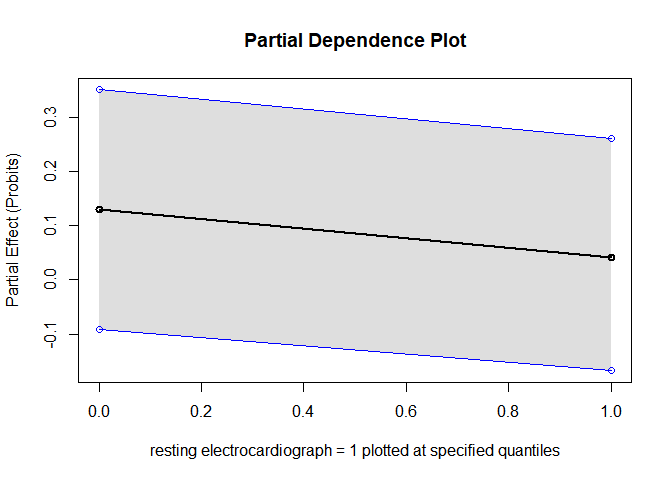<!-- -->

    ## ..

<!-- -->

    ## ..

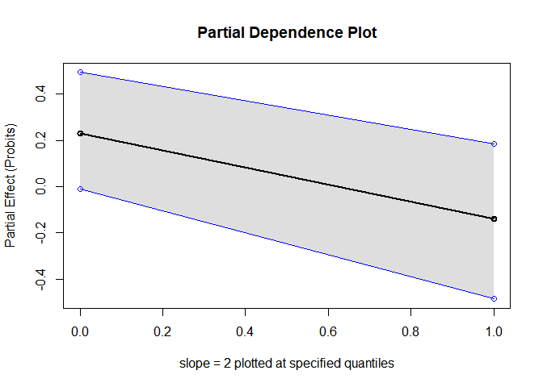<!-- -->

    ## ..

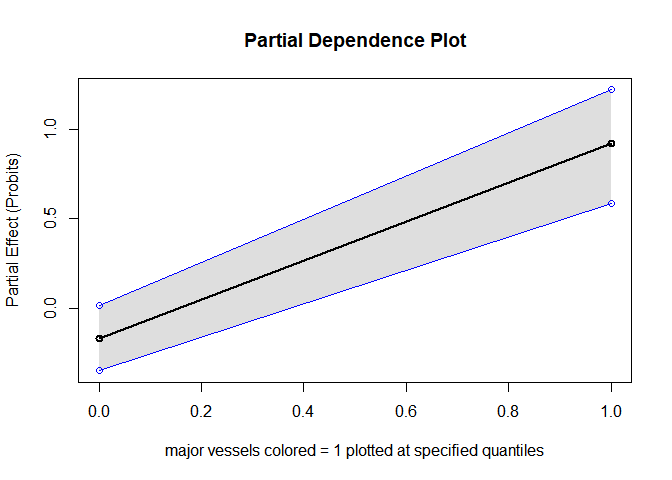<!-- -->

    ## ..

<!-- -->

    ## ..

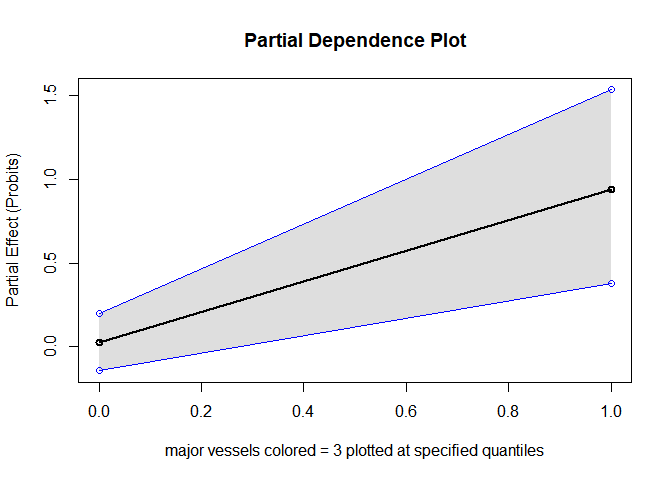<!-- -->

    ## ..

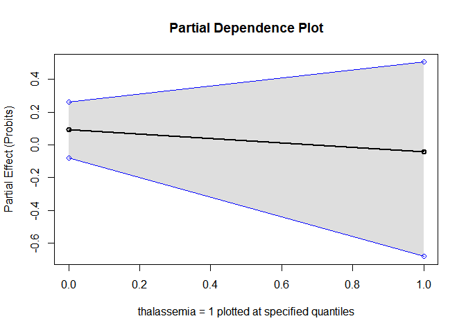<!-- -->

    ## ..

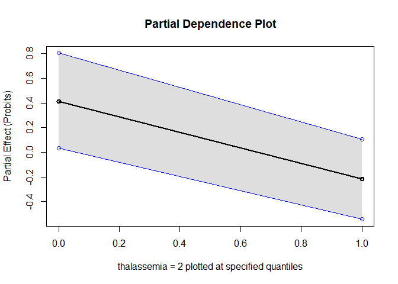<!-- -->

    ## ..

<!-- -->

``` r
p_pred <- 1 - predict(bart_mod, X_test, type = 'prob')
```

    ## predicting probabilities where "0" is considered the target level...

``` r
roc <- ROCMetrics$new(y_true = y_test, p_pred = p_pred)
thresholds <- roc$threshold.matrix(0.001)
roc$roc_plot(thresholds, file_name = 'plots/bart_roc.png')
```

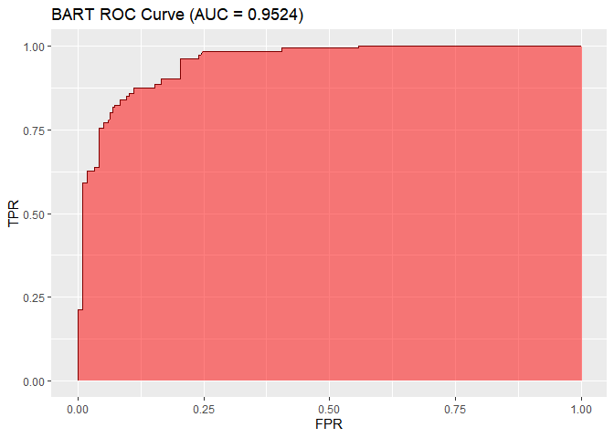<!-- -->

``` r
p_th <- row.names(thresholds)[which(thresholds$`Balanced Accuracy` == max(thresholds$`Balanced Accuracy`))]
paste0('Optimal threshold: ', max(p_th))
```

    ## [1] "Optimal threshold: 0.517"
